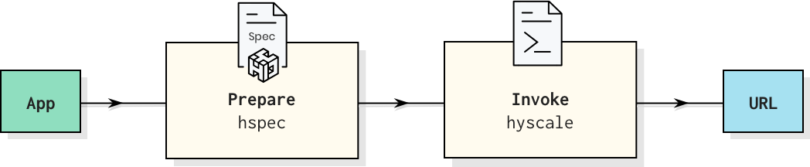
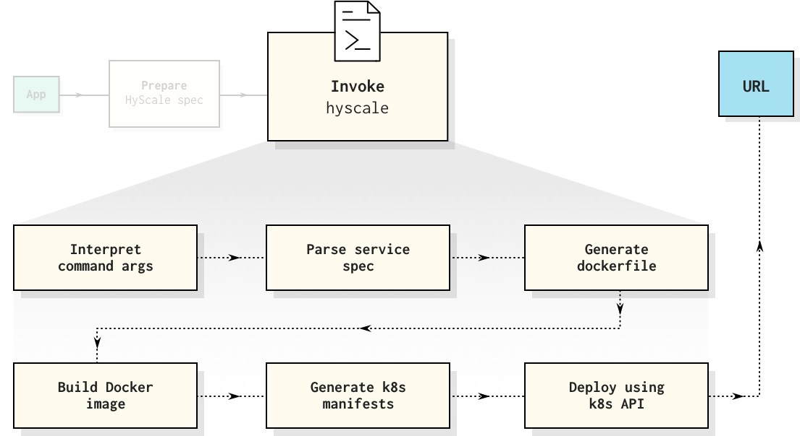

### The K8s App Deployment Tool 

Kubernetes (K8s) has emerged as the de facto container orchestration platform offering excellent abstraction over infrastructure. But app deployments and delivery mechanisms to K8s are still way too complex. Delivery tools should simplify things for a developer so that developers can focus on writing apps & building value. This is best achieved if all the complexity of deployment completely disappears!

HyScale is a starting point for how a simplified service spec can allow developers to easily deploy the various (micro-)services in their app to K8s without having to wade through K8s complexities and also without having to write or maintain hundreds of lines of manifest yamls.

## Capabilities

**Automatic containerization & auto-generation of K8s yamls**

HyScale offers a declarative spec for K8s abstraction using which K8s manifests & docker files are automatically generated, docker images are built & pushed to the target docker registry, and the manifests are deployed to the K8s cluster resulting in a URL.


**App-centric abstraction**

Some useful things you can achieve in just a few lines with HyScale's app-centric abstraction:

+ Setting up resource-limits and enabling auto-scaling.

+ Enabling health-checks on a http path or tcp port.

+ Declaring volume paths for storing service data.

+ Providing configuration properties that are automatically made available as a file within the pod and as env props in the service container.

+ Declaring the keys for secrets such as passwords & tokens that are automatically made available from the K8s secrets store.

+ Attaching log, monitoring and tracing agents to the service.

+ Override or add different configurations for different environments using profiles.


**App-centric troubleshooting** (in the works)

Deployment failures at Kubernetes are cryptic and not intuitive for debugging. Users have to refer many things to identify the root cause of the failure like pod status, describe pod , statuses of other kinds etc. When issues occur abstraction is needed to simplify troubleshooting. So instead of presenting users with an error like "CrashLoopBackOff", HyScale executes a troubleshooting flowchart that will basically try to figure out the possible causes and inform the user in plain terms. 
Hyscale abstracts Kubernetes errors to an app-centric model eg.: a "Pending" state may mean one of many things such as "New services cannot be accommodated as cluster capacity is full" or "Specified volume cannot be attached to the service"


## Getting started

Here is what you need to do:



Here is a glimpse of what HyScale does when you invoke it



To get started, install hyscale as per the below [instructions](https://github.com/hyscale/hyscale#prerequisites) & follow the [tutorial](https://www.hyscale.io/tutorial/get-started/) to deploy your first app.
For detailed information, refer [hspec](https://github.com/hyscale/hspec/blob/master/docs/hyscale-spec-reference.md).

## Prerequisites
In order to deploy your service to K8s, you must have the following configurations and installations in place on your machine from which you wish to deploy your application.
1. Docker 18.09.x or above. Your Linux user should be part of the docker group and `docker.sock` should be present at /var/run/docker.sock (Default location) 
2. Kubernetes authentication credentials kubeconfig file having the cluster token placed at $HOME/.kube/config
3. Image registry credentials at $HOME/.docker/config.json . Make sure `config.json` has the latest auth creds by logging into the image registry using `docker login` prior to deployment.

If you do not have access to a kubernetes cluster and wish to deploy your application to a local cluster on your machine, you could try setting up [minikube](https://kubernetes.io/docs/tasks/tools/install-minikube/) or [kind](https://github.com/kubernetes-sigs/kind).

## Installation

#### Linux

Open your terminal and enter the following:

```sh
curl -sSL http://get.hyscale.io | bash
```

#### Mac 
Usage Pre-Requisites:

* JDK version 11 and above
* Download the [hyscale jar](https://github.com/hyscale/hyscale/releases/latest/download/hyscale.jar) to your local machine

Usage:

`java -jar </path/to/hyscale.jar> <commands>` ,  

For commands refer [here](https://github.com/hyscale/hyscale/blob/master/docs/hyscale-commands-reference.md) by replacing `hyscale` with `java command`.  

```
Example :  java -jar </path/to/hyscale.jar> deploy service -f myservice.hspec -n my-namespace -a my-app
```

Verified on CentOS, Ubuntu and Debian Linux,Mac .  Windows installer coming soon!

## Deploying to K8s

### Preparing your first service spec (hspec)

Here is a basic service spec for deploying tomcat (without any application). To get started with more options see the [tutorial](https://www.hyscale.io/tutorial/get-started/).

##### myservice.hspec

```yaml
name: myservice
image:
    registry: registry.hub.docker.com
    name: library/tomcat
    tag: 8.5.0-jre8
 
volumes:
    - name: tomcat-logs-dir
      path: /usr/local/tomcat/logs
      size: 1Gi
      storageClass: standard

replicas:
    min: 1
    max: 3
    cpuThresold: 40%
 
external: true
ports:
  - port: 8080/tcp
    healthCheck:
       httpPath: /docs/images/tomcat.gif

```
Managing configuration differences across environments is necessary, so a hspec alone may not be sufficient across all environments. Environment specific configurations can be achieved through [profiles](https://github.com/hyscale/hspec/blob/master/docs/hyscale-spec-reference.md#profile-files) as shown in the example below.

####  Stage profile for myservice can be like

##### stage-myservice.hprof

```yaml
environment: stage
overrides: myservice
 
volumes:
    - name: tomcat-logs-dir
      size: 2Gi

replicas:
    min: 1
    max: 4
    cpuThreshold: 30%
 

```

### Deploy the service

**To deploy, invoke the hyscale deploy command:**
    
```sh
hyscale deploy service -f `<myservice.hspec>` -n `<my-namespace>` -a `<my-app-name>`
```

**To deploy with profiles, invoke the hyscale deploy command:**
    
```sh
hyscale deploy service -f `<myservice.hspec>` -n `<my-namespace>` -a `<my-app-name>` -p `<stage-myservice.hprof>`
```

**To view the status of your deployment:**

```sh
hyscale get service status -s `<myservice>` -n `<my-namespace>` -a `<my-app-name>`
```

**To view logs:**
```sh
hyscale get service logs -s `<myservice>` -n `<my-namespace>` -a `<my-app-name>`
```

For all possible commands, see the [command reference](docs/hyscale-commands-reference.md).

### Contributing

If you wish to contribute, see the architecture & contributor documentation [here](docs/contributor-guide.md).

### Connect with us
We would love to know your experiences with HyScale. Write to us at connect@hyscale.io if you have any questions or issues and we will respond as quickly as we can. Suggestions are welcome too!
You can also follow us on [Twitter](https://twitter.com/hyscaleio) and [Medium](https://medium.com/@teamhyscale) to keep a tab on interesting developments from the team 
