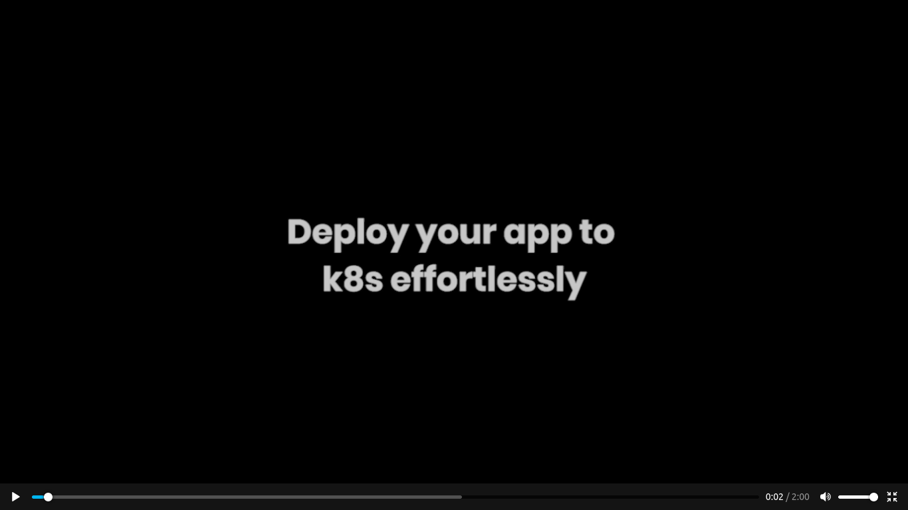

[](https://github.com/hyscale/hyscale/actions?query=workflow%3ABuild)
[](https://sonarcloud.io/dashboard?id=io.hyscale%3Ahyscale)
[](https://github.com/hyscale/hyscale/releases/latest)

***

**Kubernetes (K8s) is complex.** This makes application deployment to K8s challenging, time-consuming, tedious and error-prone. But it doesn't have to be that way.

This project is aimed at building **an abstraction framework over K8s (for app deployments)** in the same vein as jQuery over Javascript or Spring over servlets.

HyScale takes a simple, short Declarative definition of your service config, given the config it generates Dockerfile, Container Image, Kubernetes Manifests (YAMLs) and deploys to any Kubernetes Cluster returning back the app URL. Also it abstracts & simplifies Deployment Troubleshooting and Runtime Ops.

HyScale can be used to deploy either Monolithic or Microservice Applications.

## Table of Contents

- [Abstraction over K8s](#abstracting-k8s)
- [Demo](#demo)
- [Examples](#examples)
- [Installation](#download--try)
- [Troubleshooting](#completing-the-abstraction--troubleshooting--ops)
- [Contribute](#contribute)
- [Wiki](https://github.com/hyscale/hyscale/wiki)

## Abstracting K8s

Containerizing apps and deploying them to K8s can be tedious and error-prone with having to write & maintain large portions of yaml, dealing with cryptic K8s error messages, challenging new ops and keeping up with new K8s versions. An abstraction brings higher-level objects & actions that are intuitively understood by developers & devops professionals alike making deployments, maintenance & troubleshooting a breeze!

Such an [abstraction](https://github.com/hyscale/hyscale/wiki/App-centric-Abstraction) must: <br />
a) be declarative, <br />
b) intuitive to read, and <br /> 
c) orders of magnitude smaller to write & maintain

***


***

## Demo
[](https://www.hyscale.io/wp-content/uploads/2020/05/200521-HS-OSS-1.mp4)

For more detailed information refer the [wiki](https://github.com/hyscale/hyscale/wiki).

## Examples

For instance, if your service requires to persist some data at the path /mydata , all you would need to declare is:

```yaml
volumes:
    - name: myvol
      path: /mydata
      size: 1G
```

and leave to the abstraction framework all the details of generating the right yamls & labels for stateful sets, persistent volume templates, with PVCs linked to the storage class, etc.


Similarly, if your service needs auto-scaling, the high-level intent declaration would be something like this:

```yaml
replicas:
      min: 2
      max: 5
      cpuThreshold: 80%
```
Of course you can have different profiles to override things for different environments of your app.

To see what other things you could specify in an app-centric declarative way and how to write a complete spec file, **check out the tutorial [here](https://github.com/hyscale/hyscale/wiki/Tutorial)**.

You can also find spec files for a few sample applications [here](https://github.com/hyscale/hyscale/tree/master/examples).


## App2URL | Deploying to K8s

Once you've written the [declaration of your service's requirements](https://github.com/hyscale/hyscale/wiki/Tutorial) (we call it a hspec file), deploying and obtaining a URL is a one-line command:

```hyscale deploy service -f '<myservice.hspec>' -n '<my-namespace>' -a '<my-app-name>'```

HyScale will generate the dockerfile if necessary, build & push the docker image, generate the required K8s yamls and talk to the K8s cluster specified at $HOME/.kube/config . At the end of this command execution, you should see a URL with which to access your app!


## Completing the abstraction | Troubleshooting & Ops

If, say, you got an error message such as CrashLoopBackOff, the abstraction would tell you whether that was due to an erroneous CMD in your dockerfile, a failing health-check or a missing entrypoint for your service. 

For more on app-centric automated troubleshooting, see [here](https://github.com/hyscale/hyscale/wiki/App-centric-Troubleshooting)

And if you wanted to perform some operations such as getting the logs of a service, all you would do is say something like 
```hyscale get service logs -s <service-name>```


## Download & Try

To run HyScale, you need Docker 18.09.x or above, your Kubernetes cluster token at $HOME/.kube/config and registry credentials at $HOME/.docker/config.json. Make sure you have logged into your docker registry using `docker login`.

If you are on Linux, install using:
```sh
curl -sSL https://get.hyscale.io | bash
```

For more details on pre-requisites as well as instructions for Windows & Mac, see [here](https://github.com/hyscale/hyscale/wiki/Installation).


## Community
Let us know your experience with HyScale!
* Follow [@hyscaleio](https://twitter.com/hyscaleio) for updates on Twitter 
* Read [@teamhyscale](https://medium.com/@teamhyscale)  for updates and musings on Medium
* Write to us at connect@hyscale.io  and we will respond as quickly as we can.


## Contribute

Our initial goal is to achieve sufficient abstraction levels to satisfy at least 80% of the app deployment use-cases out there. 

Do you have any inputs that can make HyScale better? Say, a bug or a feature request? Please open a new issue [here](https://github.com/hyscale/hyscale/issues). 

To contribute, see our architecture & contributor documentation [here](https://github.com/hyscale/hyscale/blob/master/docs/contributor-guide.md).
