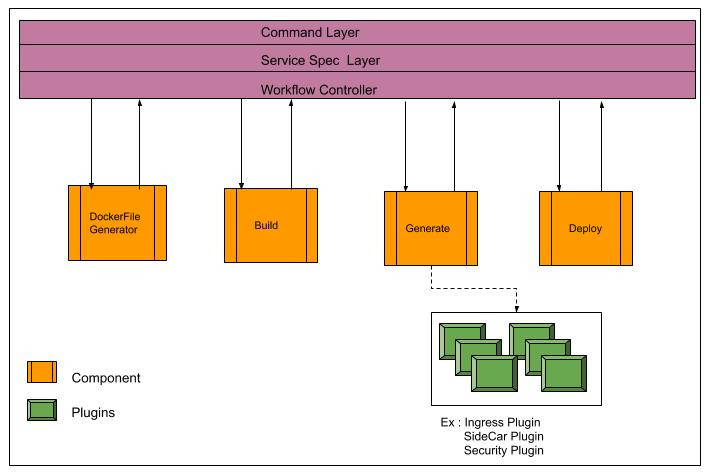
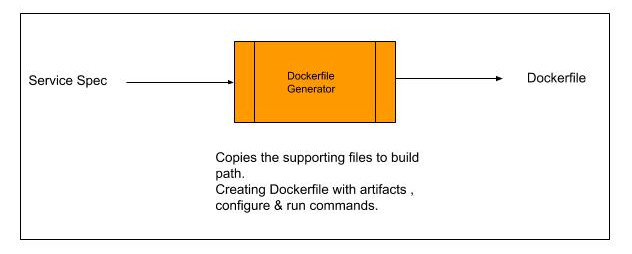
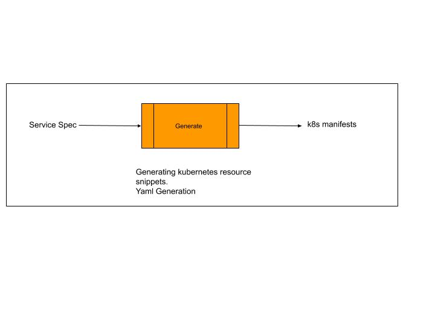
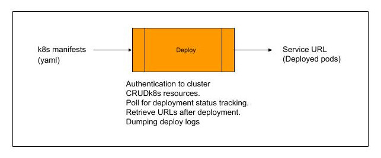

# Hyscale-Tool Developer Guide

> Version 1.0B <br /> Last Updated 27th September 2019

---

**HyScale** (_hyscale_) is an app deployment tool designed to help developers deploy apps to Kubernetes without having to learn k8s concepts or write & maintain k8s manifests. Powered by HyScale’s enterprise-grade deployment automation & abstraction capabilities, hyscale-ctl accelerates developer adoption of Kubernetes for dev/test environments.

### Prerequisites

*   Docker 
*   Docker registry credentials at `<user.home>`/.docker/config.json
*   Kubeconfig at `<user.home>`/.kube/config

### Architecture Overview



**Command Layer**:  This layer parses the commands entered by the user and dispatches the to input to respective command service.

**Service Spec Layer**: This layer reads the service spec from the file system and dispatches it to the workflow controller.

**Workflow Controller**: This controller reads the servicespec and controls the entire workflow of the deployment. The workflow is not chain but is controlled by the controller. Every individual component would process its task and responds back to the controller. This controller would give the necessary input to each component. Reads the kubernetes cluster details from `<user.home>`/.kube/config and also the registry details to push the image are read from `<user.home>`/.docker/config.json. 

### Dockerfile Generator Module



Generates dockerfile from the given servicespec . The dockerfile generation is an optional component if you have a ready-made dockerfile. In this case dockerfile generation is skipped. BuildSpec from servicespec is the input to create dockerfile, you can supply the artifacts ( packaged code like binaries, jar, war, scripts etc ), configuration commands if there is any requirement to customize on top of the stack image. These configuration commands are baked & run inside the image. Run commands can also be supplied incase if you want to override the docker cmd. All these configuration under buildSpec is inside a docker image.

#### Key points:

*   Dockerfile & BuildSpec in servicespec are mutually exclusive fields , they cannot exist together.
*   Dockerfile Generator is executed when **none** of the following conditions is met i.e ( when skipped ): 
    * When user has a ready-made dockerfile ie. user provided dockerfile in the service spec.
    * When both dockerfile & buildSpec are not provided.
    * When buildSpec exist & if it has no artifacts , configureCommands,  runCommands, configScript, runScript. 
*   Dockerfiles are generated at `<user.home>`/hyscale-ctl/apps/`<app_name>`/`<service_name>`/generated-files/dockerfiles/
*   Assume (`<user.home>`/hyscale-ctl/apps/`<app_name>`/`<service_name>`/generated-files/dockerfiles/ ) as _Relative Docker Path_.
*   Any supporting files referred in the buildSpec like artifacts, configuration script, run script are copied relative to the Dockerfile directory. . This is the action in Dockerfile Generation during the deploy command.
    *   Artifacts : Moved to _Relative Docker Path/_artifacts/`<Artifact-name>`/`<artifact>`
    *   Scripts: Moved(in case of ready-made scripts ) / Written (in case of commands)  to _Relative Docker Path_. These scripts are baked at /hyscale/init-scripts/ inside the container.
    *   Configure commands are run inside the image while run commands override docker `"CMD"` from the stack image if any.

**Service Image Name template as**

**[hyscale.io/<`<appName>`>/<`<serviceName>`>:<`<tag>`> ] :**

```markdown
FROM <<stackImage>>

COPY <<artifact_1>>  <<<<artifact_1_destination>>

.

.

.

COPY <<artifact_n>>  <<<<artifactn_n_destination>>

COPY configure.sh hyscalectl/init-scripts/	##Writes configure commands to configure.sh

COPY run.sh hyscalectl/init-scripts/		##Writes run commands to configure.sh

RUN hyscalectl/init-scripts/configure.sh	##Run configure commands inside image

CMD /bin/bash /init-scripts/run.sh		##Execute run commands on container startup
```

### Build & Push Module


Responsible for building the dockerfile either generated by the dockerfile generator or supplied by the user in the servicespec as `"image.dockerfile"`. Builds the image if and only if dockerfile is present.

_**Push Image**_ : Once the image is built / skipped in case of stack image , the image is tagged with `image.registry/image.name:image.tag` from the servicespec. Push uses `docker push` commands & thereby `.docker/config.json` is used to retrieve the registry credentials. User should login to registry on prior to deployment.

**Build is skipped when :**

1. When buildspec is specified by the user without any artifacts, configure, run commands & scripts ie if the user needs a plain stack image to be used as his final image for deployment. In this case build is skipped.

**Build & Push are skipped when :**

2. When there is no dockerfile or buildspec present in the servicespec ie the image is already available in the registry.

#### Key Points:

*   Docker image is built using `docker build` command in the directory “image.dockerfile.path” or _Relative Docker Path_.
*   Build logs are written to `<user.home>/hyscale-ctl/apps/<app_name>/<service_name>/logs/build.log`
*   Image is built and tagged as `hyscale.io/<app_name>/<service_name>:<tag>`
*   During push, tool automatically does a `docker login` again to verify the credentials are correct. If the login fails , push fails and deployment is exited. 
*   After successful login, push command is executed using `docker push` command.
*   Push logs are written to `<user.home>/hyscale-ctl/apps/<app_name>/<service_name>/logs/push.log`

### Manifest Generator Module



Generates the kube manifest from the given service spec . Manifest generation is a combination of different plugins. Each plugin is responsible for generating a snippet of manifest. When all these snippets are joined / merged together we get a complete set of kube manifests. 

#### Key Points: 

*   Each plugin specifies the snippet to be injected into which kind and at what path .
*   All the snippets are merged into manifests using a tree insertion treating each snippet to be node to the manifest tree .
*   Each plugin can insert multiple snippets into a set of manifests, which results in injecting multiple nodes to the tree.
*   If a snippet injection fails the rest of the plugins will still be processed and injected . Plugin order is decided by the plugins.txt file the generator-services module. 
*   After processing all the plugins,  each manifest of a specific kind & name are written to a file at `<user.home>/hyscale-ctl/apps/<app_name>/<service_name>/generated-files/manifests/` . The name of the manifest file is determined by the kind & name, while the name of the manifest resource is normalized(`<app_name>-<service_name>`).
*   Each service might result in the set of manifest resources : ConfigMap for _props_, Secrets for _secrets_, Deployment / Statefulset ,Service , ImagePullSecret for _image-registry-credentials_, Pods, PVC. 
*   Tool creates a statefulset if and only if volumes are present in the servicespec else deployment is created.

**Labels inserted by tool :**

*   hyscale.io/appName : App Name from the command line, `-a <<appName>>` 
*   hyscale.io/serviceName: service name from .hspec, `-f <<.hspec>>`
*   hyscale.io/envName : default _`<ns>-dev`_

#### Manifest Plugins

*   MetaDataHandler : Creates  the metadata of kubernetes resources of configmaps, secrets, service, deployment,statefulset . Each metadata is prepared as a snippet with its respective kind.
*   ConfigMapDataHandler : Created the configmap data from the servicespec props field. If there are no props in the servicespecs , this plugin is skipped.
*   SecretsDataHandler : Secrets data is handled when secrets from servicespec are specified as a map only , if they are specified as a list of secrets, tool expects the user to create secrets prior to the deployment with the name `"<app_name>-<service_name>"`.
*   ReplicasHandler: Created the replicas snippet based on the servicespec replicas either in deployment / statefulset. 
*   SelectorLabelsHandler: Handles the selector labels for service, statefulset/deployment
*   PodSpecLabels: Handles the labels for pods 
*   VolumesHandler : Creates volumes for statefulset from configmap,secret  if any has to be mounted to the pod.
*   ImagePullSecretHandler : Creates image pull secret with registry credentials and refers the secret in the statefulset.
*   StartCommandHandler : Creates the command & args for statefulset / deployment , `_startCommands_ : "a,b,c"` , `_a_` is considered as the command & `_b_`,`_c_` are considered as the args to statefulset/deployment.
*   ContainerNameHandler : Creates the name of the container as the service name.
*   ImageHandler : Handles the image for the statefulset/deployment by concatenating _`image.registry/image.name : image.tag`_ from the given servicespec.
*   PodSpecEnvHandler: Creates env's from configmaps & secrets with respect to keys.
*   VolumeMountsHandler: Creates the volume mounts from configmap(if props has to be mounted at "_propsVolumePath_"), secrets ( if secrets has to be mounted at "_secretsVolumePath_") & also  any declared volumes in the given servicespec.
*   PortsHandler: Handles the ports of statefulset/ deployment
*   HealthChecksHandler : Handles the liveness & readiness probe of  statefulset/deployment from the ports field in the servicespec.
*   ResourceLimitsHandler: Handles the memory & cpu limits of statefulset/deployment from "_memory_" in servicespec
*   VolumeTemplatesHandler : Creates volumeClaimTemplates from the declared volumes of the given  servicespec. Request to create the volume dynamically.
*   ServiceTypeHandler : Handles the exposure of the service , whether the service is an internal service ( exposed only within the cluster for the communication of other services ) or external ( to be accessed publicly )

###  Deployer Module



Deploys the manifest into kubernetes cluster . The cluster details are read from `<user.home>`/.kube/config file. User has to have a ready-made cluster to go for service deployments.

#### Key Points:


*   Creates the manifest and apply it on the resource,  apply takes care of creating / updating the resource.
*   Every resource is created with a default annotation as `_hyscale.io/last-applied-configuration_` which actually has the actual manifest that has been deployed. This helps to patch the  resources on update. The patch is a json-patch constructed from the diff of new-manifest & old-manifest( fetched from the cluster with `_hyscale.io/last-applied-configuration_`) . The json-patch is then applied to the cluster and therefore the resource is updated.
*   Incase patching fails , the resource is automatically deleted & created again to ensure the availability of the resource. 
*   The deployer also undeploy all the resources incase of undeploy service / undeploy app.
*   Fetches the pod logs from the cluster and persistence them as deploy logs on deployment, this ensures the deployment logs to be there even after the pod restarts incase of failures. The pod logs can be fetched at any point of time with the "_hyscalectl get service logs_" command which are then persisted in service.logs file.
*   Pod logs can also be tailed with _`-t`_ option in `_hyscalectl get service logs_`.
*   `_hyscalectl get service status_` responds to whether the service has been deployed , not deployed, running along with proper message of the action

### Debugging:


*   In case the service deployment fails at any stage, the respective stage logs at `<user.home>`/hyscale-ctl/apps/`<app_name>`/`<service_name>`/logs/ gives enough information to user to debug the cause of failure else you can check for `<user.home>`/hyscale-ctl/apps/`<app_name>`/`<service_name>`/logs/ will give the information of what failed for command execution.
*   Incase of deployment failures after a successful deployment, user can check for pod logs
*   hyscalectl get service status -s `<service_name>` -a `<app_name>` -n `<namespace>` the message field gives the reason in case failed pods 
*   In detail troubleshooting can be enabled by  hyscalectl get service logs -s `<service_name>` -a `<app_name>` -n `<namespace>`
