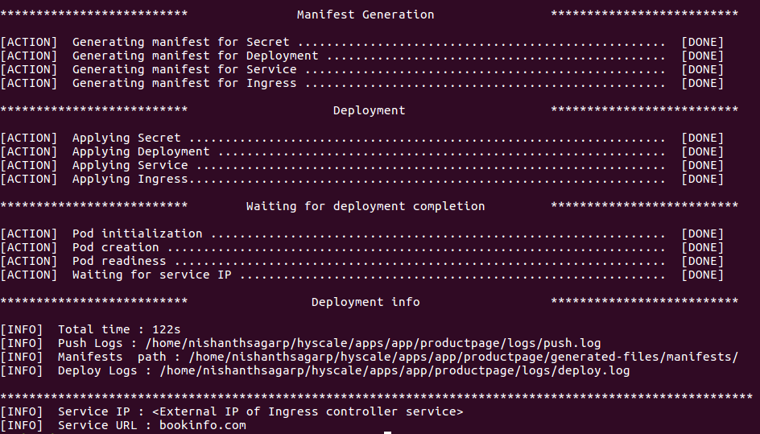
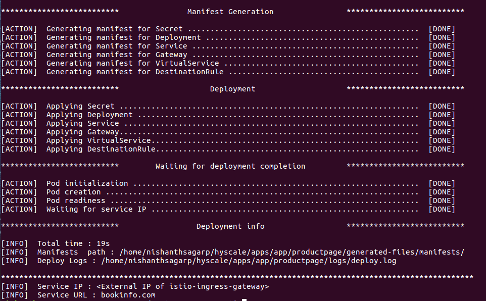

# Load Balancer Support in HyScale
#### Description
Kubernetes provides a variety of means to expose a service to the outside world for bringing external traffic into a cluster. 
HyScale currently allows exposing a service externally by utilizing Kubernetes service type 'LoadBalancer'.
Although you can use it for HTTP(S) traffic, they operate in OSI layers 3/4 and are not aware of HTTP connections or 
individual HTTP requests and responses.

There are multiple methods (Ingress, Service Mesh)  and multiple providers for each method (Nginx, Traefik, Istio) that
are offering OSI Layer 7 Load balancing capabilities but with a shortcoming of having different configurations for each provider.
With so many options, there cannot be only one right choice for services to be exposed externally. 
The choice varies depending upon the usability and functional requirements of a service/application.

We abstracted load balancing support in K8s by defining basic requirements to a layer 7 load balancer such as how to route 
requests to backend services based on HTTP URL/Host, TLS key, certification configuration and which provider to use. 
Thereby generating required manifests based on the provider and simplifying the configuration across different providers.


### Unification of Ingress and Service Mesh
Ingress can provide basic layer 7 load balancing capabilities. Whereas Service mesh holds additional functionalities like advanced routing rules, distributed tracing, policy checking and metrics collections.
But both Ingress and Service mesh commonly provide the primary functionality for Load balancing, SSL termination and virtual hosting and also share the majority of use cases.
Thus unification of Ingress and Service Mesh makes more sense from a load balancing perspective.

### In short, How it works?
So basically, we plucked a common feather (Routing Rules) out of each one's (Ingress & Service Mesh) hat. 

### Prerequisites
There are certain cluster level configurations depending upon loadBalancer Type (Ingress or Service Mesh) that a user has to perform before deploying a service with load balancer support using HyScale.

In the case of Ingress:
 - Deploying the Ingress Controller in the respective namespace. (Nginx/Traefik)
 
In the case of Service Mesh:
 - Installing Service Mesh (Istio) in the cluster.


### Introducing the 'loadBalancer' field 
We crafted a new field "loadBalancer" in Hspec by picking some minimum requirements to configure an OSI Layer 7 LB. 
Wherein a user can write routing rules for respective ports that are defined for that service. 
Refer loadBalancer in [HyScale spec reference](https://github.com/hyscale/hspec/blob/master/docs/hyscale-spec-reference.md#).

Note: The external field of hspec should be true in order to expose a service using loadBalancer.
### Enabling Ingress for routing with HyScale
A simple hspec with loadBalancer configuration for Nginx Ingress looks like :

```yaml
name: productpage
image:
    registry: registry.hub.docker.com
    name: istio/bookinfo-productpagev1
    tag: 1.16.2
external: true
ports:
  - port: 9080/http

loadBalancer:
    className: nginx-ingress-class-name
    provider: nginx
    host: bookinfo.com
    sticky: true
    tlsSecret: default-server-secret
    mapping:
       - port : 9080/http
         contextPaths:
              - "/productpage"
              - "/static"      
    headers:
        key1 : value1
        key2 : value2
```
As mentioned, It's a prerequisite and part of user's responsibility to provide an Ingress Controller (Nginx or Traefik) in the namespace in which the service has to be deployed using HyScale.
   #### - Defining Ingress Class 
   Each `Ingress` resource needs to specify a class, a reference to an `IngressClass` resource that contains additional configuration including the name of the controller that should implement the class. Before the `IngressClass` resource was added in Kubernetes version 1.18, a similar concept of Ingress class was often specified with a `kubernetes.io/ingress.class` annotation on the Ingress. 
   As part of user's responsibility an `IngressClass` needs to be created by the user and its name to be mentioned in `className` field in the hspec loadBalancer configuration.
   #### - Defining Provider Name
   Currently HyScale supports two providers for Ingress i.e Nginx and Traefik. You can choose any of them and mention it in `provider` field in the hspec loadBalancer configuration.
   #### - Defining Routing Configuration
   Routing configuration includes specifying host name, TLS secret name if available, mapping rules, headers and enabling or disabling session stickiness in the corresponding fields `host` ,`tlsSecret`,  `mapping`, `headers` and `sticky`  .
  #### Note: Mandatory fields are 
  - `provider`
  - `host`
  - `mapping`

#### -  Manifest Generation and Deployment
 Here an `Ingress` resource created and applied based on the loadBalancer configuration provided in the hspec.
 Configure the external IP Address of Ingress controller service for the service URL provided to access the service.
   
   
 #### Note:
 In Kubernetes versions below 1.18, It is not mandatory to define Ingress class. So incase ingress class is not defined, ingress resource binds with a default ingress controller whichever is available. Hence, we have not made field `className` as mandatory for loadBalancer configuration. But, If you are deploying on kubernetes versions above 1.18 make sure you provide a valid `className`, else the deployment may fail.
   ### Enabling Service Mesh for routing with HyScale 
A simple hspec with loadBalancer configuration for Istio Service Mesh looks like :

```yaml
name: productpage
image:
    registry: registry.hub.docker.com
    name: istio/bookinfo-productpagev1
    tag: 1.16.2
external: true
ports:
  - port: 9080/http

loadBalancer:
    provider: istio
    host: bookinfo.com
    sticky: true
    tlsSecret: default-server-secret
    mapping:
       - port : 9080/http
         contextPaths:
              - "/productpage"
              - "/static"      
    headers:
        key1 : value1
        key2 : value2
    labels:
        key : value
```
Here, It's a prerequisite and part of user's responsibility to ensure Istio is installed in the cluster and that the namespace is istio-enabled in which the service has to be deployed using HyScale.
#### - Defining Labels 
   The labels (can be one or multiple)  provided here in hspec loadBalancer confiuguration are added to the gateway configuration as selector. Add these labels to the `istio-ingressgateway` deployment resource.
   #### - Defining Provider Name
   Currently HyScale supports only one provider for Service Mesh i.e Istio. Mention it in `provider` field in the hspec loadBalancer configuration.
   #### - Defining Routing Configuration
   Routing configuration includes specifying host name, TLS secret name if available, mapping rules, headers and enabling or disabling session stickiness in the corresponding fields `host` ,`tlsSecret`,  `mapping`, `headers` and `sticky`  .
   #### Note: Mandatory fields are 
  - `provider`
  - `host`
  - `mapping`
  - `labels`
 #### -  Manifest Generation and Deployment
 Here three resource manifests are created and applied- `Gateway`, `VirtualService` and `DestinationRule` based on the loadBalancer configuration provided in the hspec.
 Configure the external IP Address of istio-ingress-gatway for the service URL provided to access the service.
 
 
 

